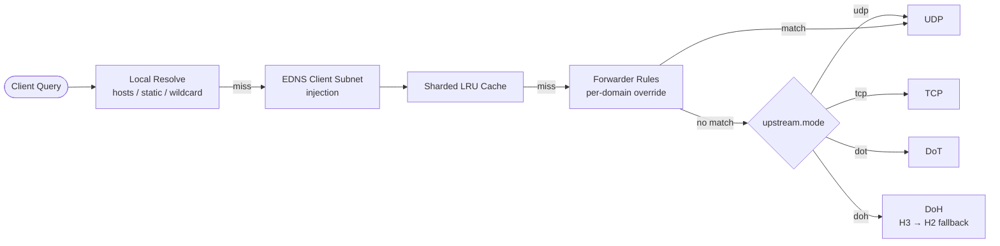

# 🌐 DNS Proxy

**DNS-Proxy** is a DNSMasq-style DNS proxy/forwarder written in Go, with modern upstream
transport support beyond plain UDP/TCP — **DNS-over-TLS (DoT)** and **DNS-over-HTTPS (DoH)**.

It ships as a single `CGO_ENABLED=0` static binary, resolves through a
local → cache → forwarder → upstream chain, and hot-reloads its config on `SIGHUP`
without dropping in-flight queries.

---

## ✨ Why DNS-Proxy?

*   **🔐 Modern Upstream Transports:** plain UDP, plain TCP, DoT, and DoH — selected by
    `upstream.mode`, with DoH falling back from HTTP/3 to HTTP/2 automatically.
*   **⚡ Sharded Response Cache:** power-of-two-sharded LRU keyed by query name + type,
    honoring answer TTLs with a configurable floor and a separate negative-response TTL.
*   **🏠 Local Resolution:** static records, `/etc/hosts`-style file, and glob-mergeable
    `include_files` for managed local zones.
*   **↪️ Forwarder Rules:** per-domain upstream overrides, independent of the global
    `upstream.mode`, also `include_files`-mergeable.
*   **🌍 EDNS0 Client Subnet:** optional ECS injection with configurable IPv4/IPv6 mask, for
    upstreams that use it for geo-aware answers.
*   **🛡️ Bogus-NXDOMAIN Filtering:** strips known ISP-hijack/sinkhole IPs from upstream
    answers when enabled.
*   **🔄 Zero-Downtime Reload:** `SIGHUP` rebuilds the entire runtime and swaps it in
    atomically — no lock held across upstream I/O, no dropped in-flight queries.
*   **📦 Single Static Binary:** `CGO_ENABLED=0`, cross-compiles cleanly for
    Linux / macOS / Windows.

---

## 🏗️ Architecture at a Glance



See **[docs/ARCHITECTURE.md](docs/ARCHITECTURE.md)** for the full module map and component
internals.

---

## 📚 Documentation

| Doc | Covers |
|---|---|
| [docs/ARCHITECTURE.md](docs/ARCHITECTURE.md) | Module map, component internals, request pipeline |
| [docs/WORKFLOWS.md](docs/WORKFLOWS.md) | Startup, query flow, hot-reload, error recovery |
| [docs/PROJECT.md](docs/PROJECT.md) | Overview, features, security model |
| [dns-proxy.yaml.example](dns-proxy.yaml.example) | Full annotated config reference |

---

## ⚠️ Upgrading

> `upstream.skip_tls_verify` now defaults to `false` (was `true`). A config that relies on
> the old implicit default and talks to a self-signed `dot`/`doh` upstream will start
> failing TLS validation after upgrade — set `skip_tls_verify: true` explicitly if that's
> intended (a `WARNING` is logged on startup/reload when it is).

---

## 🚀 Getting Started

### 📋 Prerequisites

*   **Go** (1.25+)
*   **Make** (for builds)
*   **GoReleaser** (for mass binary distribution)

Optional:
*   **Docker** (application containerization)

---

## 🛠️ Deployment

### 🐳 **Using Container**

```sh
docker run -d \
  -p 5353:5353/udp \
  -p 5353:5353/tcp \
  -v ./dns-proxy.yaml:/usr/app/dns-proxy/dns-proxy.yaml \
  --name dns-proxy \
  --rm dimaskiddo/dns-proxy:latest \
  dns-proxy -config ./dns-proxy.yaml
```

Docker's `-p` publishes TCP only by default — dns-proxy listens on both UDP and TCP, so
both flags are required. `-p 5353:5353` alone leaves the UDP listener unreachable from
outside the container.

### 📦 **Using Pre-Built Binaries**

1.  Download the latest release from the [Releases Page](https://github.com/dimaskiddo/dns-proxy/releases).
2.  **Installation & Startup:**

#### 🐧 **Linux / 🍎 macOS**
```sh
chmod 755 dns-proxy
mv dns-proxy.yaml.example dns-proxy.yaml

./dns-proxy -config ./dns-proxy.yaml
```

#### 🪟 **Windows**
```powershell
ren dns-proxy.yaml.example dns-proxy.yaml

.\dns-proxy.exe -config .\dns-proxy.yaml
```

### 🏗️ **Build From Source**

```sh
git clone -b master https://github.com/dimaskiddo/dns-proxy.git
cd dns-proxy
make vendor
make build
# Binary is located per GOOS/GOARCH in the dist output
```

`make run` runs straight from source without a build step; `make release` cross-compiles
mass distribution binaries via GoReleaser.

---

## 🕹️ Usage & Commands

```
dns-proxy [-config|--config <path>]   # Start the DNS proxy (UDP + TCP, SIGHUP hot-reload)
dns-proxy -version | --version         # Print version + commit hash
```

The root command starts the server directly — no subcommand required. Default config path
is `./dns-proxy.yaml`, resolved relative to the process **CWD**. Single-dash flags
(`-config`, `-version`) are accepted alongside the double-dash form, kept for compatibility
with the pre-cobra invocation style.

---

## ⚙️ Configuration

| Section | Purpose |
|---|---|
| `server` | Listen addresses, message compression |
| `upstream` | Timeout, pool size, retry attempts, transport mode, buffer size, TLS verification, DoH tuning |
| `cache` | Size, shard count, min/negative TTL |
| `bogus-nxdomain` | Enable + IP list to filter from upstream answers |
| `edns` | Client Subnet enable + IPv4/IPv6 mask |
| `local` | Hosts file, static records, `include_files` glob merge |
| `forwarder` | Per-domain upstream override rules, `include_files` glob merge |

See **[dns-proxy.yaml.example](dns-proxy.yaml.example)** for the full annotated reference.

---

## 🧪 Testing

```sh
go test ./...
```

| Package | Covers |
|---|---|
| `internal/config` | `include_files` glob-merge, `upstream.mode` validation |
| `internal/cache` | Cache key derivation and TTL |
| `internal/resolver` | Local/forwarder case-insensitive matching |
| `internal/server` | `replyTo` Rcode preservation |
| `cmd/dns-proxy` | CLI flag normalization |

---

## ✍️ Authors

*   **Dimas Restu Hidayanto** - *Initial Work* - [DimasKiddo](https://github.com/dimaskiddo)

See also the list of [contributors](https://github.com/dimaskiddo/dns-proxy/contributors) who participated in this project.

---

## 🏗️ Dependencies

*   **[Go](https://golang.org/)**
*   **[GoReleaser](https://github.com/goreleaser/goreleaser)** - Automated binaries build
*   **[miekg/dns](https://github.com/miekg/dns)** - DNS message parsing/serialization
*   **[quic-go](https://github.com/quic-go/quic-go)** (+ `http3`) - DoH HTTP/3 transport
*   **[Cobra](https://github.com/spf13/cobra)** - CLI framework
*   **[Viper](https://github.com/spf13/viper)** - YAML configuration
*   **[yaml.v3](https://gopkg.in/yaml.v3)** - `include_files` glob-merge
*   **[golang.org/x/sys](https://pkg.go.dev/golang.org/x/sys)** - Platform socket tuning

---

## ⚠️ Disclaimer

**DO WITH YOUR OWN RISK (DWYOR)**. This software is provided "as is", without warranty of
any kind, express or implied. Use of this software may involve risks, including but not
limited to service disruption or data loss. The authors are not responsible for any damage
caused by the use of this application.

---

## ⚖️ License

Distributed under the **MIT License**. See [LICENSE](LICENSE) for the full text.

---
**DNS-Proxy** — *A Modern DNSMasq Alternative.* 🌐🔀
