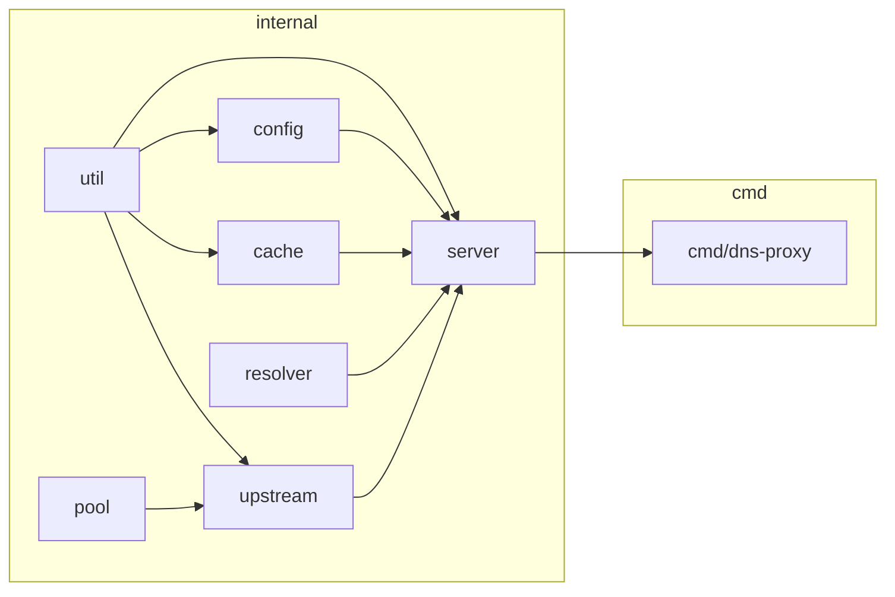

# DNS-Proxy — Architecture

DNS proxy/forwarder: `dns.HandleFunc` receives every query, `Server.Runtime()` loads the current `*Runtime` atomically, and resolution falls through local records → cache → forwarder rules → configured upstream mode. Reload swaps the whole `Runtime` rather than mutating shared state under a lock. **Config defaults:** see `dns-proxy.yaml.example` — never guess values.

---

## Module Map



## Component Table

| Component | Package | Role |
|---|---|---|
| **Server** | `internal/server` | `Runtime` construction, `atomic.Pointer[Runtime]` hot-swap, `HandleRequest` dispatch, UDP/TCP listeners |
| **Upstream** | `internal/upstream` | `Client` — one struct, four transports (udp/tcp/dot/doh), DoH via `hybridRoundTripper` |
| **Pool** | `internal/pool` | Generic pooled `*dns.Conn`, dial function injected by the caller |
| **Cache** | `internal/cache` | Sharded LRU keyed by question, per-record TTL, separate negative TTL |
| **Resolver** | `internal/resolver` | `Local` (hosts file + static + wildcard), `Forwarder` (per-domain upstream override), `EDNS` (Client Subnet), `Bogus` (NXDOMAIN IP filter) |
| **Config** | `internal/config` | `Config` struct tree, `Manager` (viper load/reload), `mergeIncludeFiles` glob merge |
| **Util** | `internal/util` | Socket buffer/keepalive tuning (build-tagged), IPv6 record filtering, `NextPowerOfTwo` |

## Request Pipeline

`Server.HandleRequest` resolves each query in this order:

1. `disable_ipv6` check — if enabled and the question is `AAAA`, reply empty immediately.
2. Empty-question guard — `len(r.Question) == 0` replies `FORMERR`.
3. `Local.Resolve` — hosts file / static records / wildcard match.
4. `Cache.Get` — sharded LRU lookup by question.
5. `EDNS.AddECS` — inject Client Subnet option if enabled.
6. Forwarder match — `Forwarder.GetUpstream` by domain; on match, always forwards via `ForwardUDP` with the matched targets, bypassing the configured mode.
7. Otherwise forward by `upstream.mode`: `ForwardDoH` / `ForwardTCP` (tcp and dot share this) / `ForwardUDP`.
8. On upstream error — reply `SERVFAIL`.
9. On success — `Bogus.Check` filters poisoned IPs if enabled, `disable_ipv6` strips `AAAA`/IPv6 glue from the answer, `Cache.Set` stores the response.
10. Reply to the client.

## Key Interfaces

```go
// internal/pool/pool.go — the seam that lets one pool serve UDP, TCP, and DoT.
type Pool struct {
    Dial func(addr string) (*dns.Conn, error)
    // ...
}

// internal/upstream/client.go — three forward paths, one Client.
func (c *Client) ForwardUDP(r *dns.Msg, targets []string) (*dns.Msg, error)
func (c *Client) ForwardTCP(r *dns.Msg) (*dns.Msg, error)
func (c *Client) ForwardDoH(r *dns.Msg) (*dns.Msg, error)
```

## Configuration

### Config Sections

| Section | Purpose |
|---|---|
| `server` | Listen addresses, message compression |
| `upstream` | Timeout, pool size, retry attempts, transport mode, DoH-specific idle-connection limits |
| `cache` | Size, shard count, min/negative TTL |
| `bogus-nxdomain` | Enable + IP list to filter from upstream answers |
| `edns` | Client Subnet enable + IPv4/IPv6 mask |
| `local` | Hosts file, static records, `include_files` glob merge |
| `forwarder` | Per-domain upstream override rules, `include_files` glob merge |

### Search Order

`--config <path>` flag, resolved relative to the process **CWD** — not `os.Executable()`. No implicit search path; the flag must point at a real file or `config.NewManager` fails.

### Hot-Reload

`SIGHUP` → `Manager.Reload()` (rebuilds config from disk + merges `include_files`) → `server.NewRuntime(cfg)` builds a fresh `Runtime` → `Server.SetRuntime` atomically installs it → the previous `Runtime.Stop()` runs after the swap. No filesystem watcher — reload is signal-driven only. A parse failure during `Reload()` leaves the previous `Runtime` serving traffic.

---

## Cross-Platform

| Concern | Solution |
|---|---|
| Socket buffer/keepalive tuning | `internal/util/socket_unix.go` (`//go:build linux \|\| darwin`) vs `internal/util/socket_windows.go` (no-op stub) |
| Filesystem paths | `filepath.Join()` throughout |
| Build | `CGO_ENABLED=0`, single static binary per `GOOS`/`GOARCH` |

---

## Key Design Decisions

1. **Atomic runtime swap** — `Server` holds `atomic.Pointer[Runtime]`; `HandleRequest` loads it once per query with no lock held across upstream I/O. Replaces a design where an `RWMutex` held during upstream network calls would block `SIGHUP` reloads behind every in-flight query.
2. **One generic connection pool** — `pool.Pool` takes an injected `Dial func(addr string) (*dns.Conn, error)`; UDP, TCP, and DoT differ only by which dial function they pass in.
3. **Constructor injection, no globals** — every dependency (`Cache`, `Local`, `Forwarder`, `EDNS`, `Bogus`, `Upstream`) is built and wired inside `server.NewRuntime`.
4. **Sharded cache** — shard count rounded to a power of two via `util.NextPowerOfTwo`, selected by FNV-64a hash of the question key, each shard an independent `container/list` LRU. Negative responses (`NXDOMAIN`, `SERVFAIL`) cache under a separate, shorter `neg_ttl`.
5. **DoH H3→H2 fallback** — `upstream.hybridRoundTripper` attempts HTTP/3 (via `quic-go/http3`) first, falling back to HTTP/2 on failure, so a network that blocks UDP/443 still gets DoH.
6. **Single static binary** — `CGO_ENABLED=0` always; no C toolchain, no dynamic linking, cross-compiles cleanly for all `.goreleaser.yml` targets.
7. **Config path relative to CWD, stdlib-first, no stubs** — no implicit executable-relative search path; every function in the codebase is complete and production-ready, matching the house Non-Negotiable Rules in `AGENTS.md`.

---

## References

| File | Purpose |
|---|---|
| `internal/server/handler.go` | `HandleRequest` — the full pipeline above |
| `internal/server/server.go` | `Runtime`, `Server`, atomic swap |
| `internal/server/listener.go` | `StartListener` — UDP/TCP socket setup |
| `internal/upstream/client.go` | `Client`, `NewClient`, `Forward*` methods |
| `internal/pool/pool.go` | Generic pooled `*dns.Conn` |
| `internal/cache/cache.go` | Sharded LRU cache |
| `internal/config/config.go` | `Config` struct tree, `setDefaultConfig` |
| `internal/config/manager.go` | `Manager`, `Reload`, `mergeIncludeFiles` |
| `dns-proxy.yaml.example` | Full annotated config reference |
