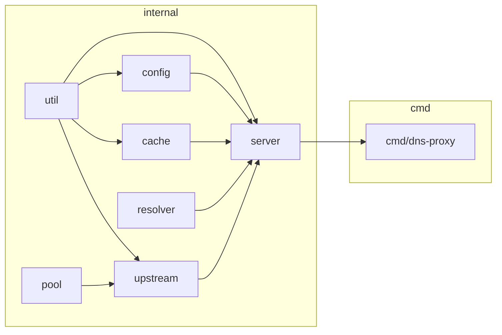

# DNS-Proxy — Architecture

DNS proxy/forwarder: `dns.HandleFunc` receives every query, `Server.Runtime()` loads the current `*Runtime` atomically, and resolution falls through local records → EDNS Client Subnet injection → cache → forwarder rules → configured upstream mode. Reload swaps the whole `Runtime` rather than mutating shared state under a lock. **Config values:** field-level defaults live in `config.setDefaultConfig`; `dns-proxy.yaml.example` is a recommended production profile that overrides several of them (e.g. `pool_size: 1024` vs the default `100`) — never guess either, check both.

---

## Module Map



## Component Table

| Component | Package | Role |
|---|---|---|
| **Server** | `internal/server` | `Runtime` construction, `atomic.Pointer[Runtime]` hot-swap, `HandleRequest` dispatch, UDP/TCP listeners (UDP `dns.Server.UDPSize` set from `upstream.buffer_size`, clamped to `[dns.MinMsgSize, dns.MaxMsgSize]`) |
| **Upstream** | `internal/upstream` | `Client` — one struct, four transports (udp/tcp/dot/doh), DoH via `hybridRoundTripper`, verifies response transaction ID on udp/tcp/dot, `Close()` releases pools + DoH idle connections |
| **Pool** | `internal/pool` | Generic pooled `*dns.Conn`, dial function injected by the caller, `Cap()`/`Close()` for retry bounding and reload teardown |
| **Cache** | `internal/cache` | Sharded LRU keyed by canonical query name + qtype/qclass (plus ECS subnet when EDNS Client Subnet is enabled), per-record TTL, separate negative TTL |
| **Resolver** | `internal/resolver` | `Local` (hosts file + static + wildcard), `Forwarder` (per-domain upstream override), `EDNS` (Client Subnet), `Bogus` (NXDOMAIN IP filter) |
| **Config** | `internal/config` | `Config` struct tree, `Manager` (viper load/reload), `mergeIncludeFiles` glob merge |
| **Util** | `internal/util` | Socket buffer/keepalive tuning (build-tagged), IPv6 record filtering, `NextPowerOfTwo` |

## Request Pipeline

`Server.HandleRequest` resolves each query in this order:

1. `disable_ipv6` check — if enabled and the question is `AAAA`, reply empty immediately.
2. Empty-question guard — `len(r.Question) == 0` replies `FORMERR`.
3. `Local.Resolve` — hosts file / static records / wildcard match (name matched case-insensitively).
4. The client's real advertised EDNS0 size (and whether it sent EDNS0 at all) is captured before `EDNS.AddECS` runs, since `AddECS` synthesizes its own OPT record for a client that sent none — reading it afterward would see the proxy's OPT instead.
5. `EDNS.AddECS` — inject Client Subnet option if enabled. Must run before the cache lookup: the cache key folds in the ECS subnet, so a geo-specific answer for one client is never served to a client in a different subnet.
6. `Cache.Get` — sharded LRU lookup by question (name compared case-insensitively) + ECS subnet.
7. Forwarder match — `Forwarder.GetUpstream` by domain (matched case-insensitively); on match, always forwards via `ForwardUDP` with the matched targets, bypassing the configured mode.
8. Otherwise forward by `upstream.mode`: `ForwardDoH` / `ForwardTCP` (tcp and dot share this) / `ForwardUDP`. An unrecognized mode (should not reach here — `Manager.Reload` rejects it at load time) fails as `SERVFAIL` rather than nil-deref'ing.
9. On upstream error — reply `SERVFAIL`.
10. On success — `Bogus.Check` filters poisoned IPs if enabled, `disable_ipv6` strips `AAAA`/IPv6 glue from the answer, `Cache.Set` stores the response.
11. Reply to the client — `SetReply`'s Rcode reset is undone so an upstream NXDOMAIN/REFUSED survives; the OPT record is stripped from the reply if the client sent no EDNS0 of its own (RFC 6891 §6.1.1), and a UDP-client reply is truncated (TC bit) to the client's real advertised EDNS0 size (default 512) captured in step 4 — not re-read from the (possibly proxy-synthesized) OPT at this point.

## Key Interfaces

```go
// internal/pool/pool.go — the seam that lets one pool serve UDP, TCP, and DoT.
type Pool struct {
    Dial func(addr string) (*dns.Conn, error)
    // ...
}
func (p *Pool) Cap() int   // configured pool_size; feeds the retry loops' maxIterations bound
func (p *Pool) Close()     // drains and closes every pooled connection

// internal/upstream/client.go — three forward paths, one Client.
func (c *Client) ForwardUDP(r *dns.Msg, targets []string) (*dns.Msg, error)
func (c *Client) ForwardTCP(r *dns.Msg) (*dns.Msg, error)
func (c *Client) ForwardDoH(r *dns.Msg) (*dns.Msg, error)
func (c *Client) Close() error // closes pools + DoH idle H2/H3 transports; called from Runtime.Stop()

// internal/cache/cache.go — query passed alongside the response so Set can derive the same
// ECS-aware key Get used to look it up.
func (c *DNSCache) Set(query *dns.Msg, resp *dns.Msg)
```

## Configuration

### Config Sections

| Section | Purpose |
|---|---|
| `server` | Listen addresses, message compression |
| `upstream` | Timeout, pool size, retry attempts, transport mode, `buffer_size` (socket tuning + UDP listener's `UDPSize`), `skip_tls_verify` (dot/doh; default `false`), DoH-specific idle-connection limits |
| `cache` | Size, shard count, min/negative TTL |
| `bogus-nxdomain` | Enable + IP list to filter from upstream answers |
| `edns` | Client Subnet enable + IPv4/IPv6 mask |
| `local` | Hosts file, static records, `include_files` glob merge |
| `forwarder` | Per-domain upstream override rules, `include_files` glob merge |

### Search Order

`--config <path>` flag, resolved relative to the process **CWD** — not `os.Executable()`. No implicit search path; the flag must point at a real file or `config.NewManager` fails.

### Hot-Reload

`SIGHUP` → `Manager.Reload()` (rebuilds config from disk + merges `include_files`) → `server.NewRuntime(cfg)` builds a fresh `Runtime` → `Server.SetRuntime` atomically installs it → the previous `Runtime.Stop()` runs after the swap. `Runtime.Stop()` stops the cache's cleanup goroutine and closes the old upstream client (pooled UDP/TCP/DoT conns, DoH idle HTTP/2 conns and HTTP/3 QUIC sessions) — a reload doesn't orphan them. No filesystem watcher — reload is signal-driven only. A parse failure during `Reload()`, an `upstream.mode` outside `udp|tcp|dot|doh`, or empty `upstream.addresses`, leaves the previous `Runtime` serving traffic.

---

## Cross-Platform

| Concern | Solution |
|---|---|
| Socket buffer/keepalive tuning | `internal/util/socket_unix.go` (`//go:build linux \|\| darwin`) vs `internal/util/socket_windows.go` (no-op stub) |
| Filesystem paths | `filepath.Join()` throughout |
| Build | `CGO_ENABLED=0`, single static binary per `GOOS`/`GOARCH` |

---

## Key Design Decisions

1. **Atomic runtime swap** — `Server` holds `atomic.Pointer[Runtime]`; `HandleRequest` loads it once per query with no lock held across upstream I/O. Replaces a design where an `RWMutex` held during upstream network calls would block `SIGHUP` reloads behind every in-flight query. The old `Runtime.Stop()` — which closes pooled connections and DoH transports via `Upstream.Close()` — runs only after the swap, so an in-flight query never has its connection closed out from under it.
2. **One generic connection pool** — `pool.Pool` takes an injected `Dial func(addr string) (*dns.Conn, error)`; UDP, TCP, and DoT differ only by which dial function they pass in.
3. **Constructor injection, no globals** — every dependency (`Cache`, `Local`, `Forwarder`, `EDNS`, `Bogus`, `Upstream`) is built and wired inside `server.NewRuntime`.
4. **Sharded cache** — shard count rounded to a power of two via `util.NextPowerOfTwo`, selected by FNV-64a hash of the cache key (canonical query name + qtype/qclass + ECS subnet suffix when present), each shard an independent `container/list` LRU. Negative responses (`NXDOMAIN`, `SERVFAIL`) cache under a separate, shorter `neg_ttl`.
5. **DoH H3→H2 fallback** — `upstream.hybridRoundTripper` attempts HTTP/3 (via `quic-go/http3`) first, falling back to HTTP/2 on failure, so a network that blocks UDP/443 still gets DoH.
6. **Single static binary** — `CGO_ENABLED=0` always; no C toolchain, no dynamic linking, cross-compiles cleanly for all `.goreleaser.yml` targets.
7. **Config path relative to CWD, stdlib-first, no stubs** — no implicit executable-relative search path; every function in the codebase is complete and production-ready, matching the house Non-Negotiable Rules in `AGENTS.md`.
8. **Rcode preservation across `SetReply`** — `dns.Msg.SetReply` unconditionally resets `Rcode` to `NOERROR`. The `replyTo` helper builds the reply via `SetReply` for the ID/question/compression bookkeeping, then restores the upstream's actual `Rcode` — otherwise every upstream `NXDOMAIN`/`REFUSED` would reach the client as a false `NOERROR`.
9. **UDP reply truncation** — a reply exceeding the client's advertised EDNS0 buffer size (default 512, captured before `EDNS.AddECS` runs so a proxy-synthesized OPT never inflates it) is truncated with the TC bit set rather than sent oversized, closing a DNS-amplification vector for spoofed-source UDP queries. The OPT record itself is also stripped from the reply if the client sent no EDNS0 of its own.
10. **Upstream transaction-ID verification** — `ForwardUDP`/`ForwardTCP` reject any response whose ID doesn't match the query's, closing the connection instead of returning it to the pool. Without this, a stale response queued on a reused pooled connection would be silently accepted, since `SetReply`-style ID matching happens client-side and a reused conn's leftover datagram would otherwise pass unnoticed.

---

## References

| File | Purpose |
|---|---|
| `internal/server/handler.go` | `HandleRequest` — the full pipeline above |
| `internal/server/handler_test.go` | `replyTo` Rcode-preservation test |
| `internal/server/server.go` | `Runtime`, `Server`, atomic swap, `Runtime.Stop()` teardown |
| `internal/server/listener.go` | `StartListener` — UDP/TCP socket setup, `UDPSize` clamping |
| `internal/upstream/client.go` | `Client`, `NewClient`, `Forward*` methods, `Close()` |
| `internal/pool/pool.go` | Generic pooled `*dns.Conn`, `Cap`/`Close` |
| `internal/cache/cache.go` | Sharded LRU cache, key derivation, `Set(query, resp)` |
| `internal/cache/cache_test.go` | Cache key/TTL tests |
| `internal/resolver/resolver_test.go` | Local/forwarder case-insensitive matching |
| `internal/config/config.go` | `Config` struct tree, `setDefaultConfig` |
| `internal/config/manager.go` | `Manager`, `Reload`, `mergeIncludeFiles` |
| `internal/config/manager_test.go` | `include_files` merge, `upstream.mode` validation |
| `dns-proxy.yaml.example` | Recommended production config profile |
