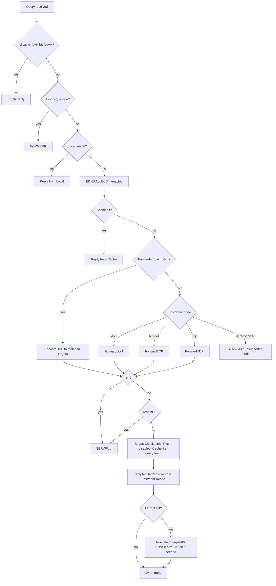

# DNS-Proxy — Workflows

Runtime request/data-flow traces through the DNS proxy — startup, per-query resolution, connection pooling, and hot-reload. **Config values:** field-level defaults live in `config.setDefaultConfig`; `dns-proxy.yaml.example` is a recommended production profile that overrides several of them (e.g. `pool_size: 1024` vs the default `100`) — never guess either, check both.

---

## Pipeline Overview

## Startup (`cmd/dns-proxy/run.go`)

1. **Load config:** `config.NewManager(configFile)` — parses YAML, applies defaults, merges `include_files` globs, validates `upstream.mode` is one of `udp|tcp|dot|doh`. Fatal on error (including an invalid mode).
2. **Build server:** `server.New()` — empty `Server` with no `Runtime` installed yet.
3. **Initial reload:** `reload(srv, mgr)` — builds a `Runtime` via `server.NewRuntime(cfg)` and installs it with `srv.SetRuntime(rt)`. Fatal on error. Also logs a `WARNING` if `upstream.skip_tls_verify` is true with mode `dot`/`doh` — the upstream certificate is not validated.
4. **Register handler:** `dns.HandleFunc(".", srv.HandleRequest)` — one handler for every query, any domain.
5. **Start listeners:** for each `server.listen` address, `server.StartListener("udp", ...)` and `server.StartListener("tcp", ...)` run as goroutines, both passed `cfg.Upstream.BufferSize`. The UDP listener uses it to set `dns.Server.UDPSize` (clamped to `[dns.MinMsgSize, dns.MaxMsgSize]`) — the largest client query accepted before FORMERR.
6. **Signal loop:** blocks on `SIGINT`/`SIGTERM`/`SIGHUP`. `SIGHUP` triggers reload and loops; anything else breaks out to `Shutdown Complete`.

## Query Flow

**ECS runs before the cache lookup** — the cache key folds in the ECS subnet, so a
geo-specific answer for one client is never served to a client in a different subnet
(would otherwise be reachable if the cache were checked first, since it's keyed on the
question alone).

## Upstream Modes

| Mode | Transport | Forward method | Notes |
|---|---|---|---|
| `udp` | Plain UDP | `Client.ForwardUDP` | Pooled `*dns.Conn`, bounded by `max_attempts` and `maxIterations` (see below) |
| `tcp` | Plain TCP | `Client.ForwardTCP` | Pooled connection, same retry logic as UDP |
| `dot` | TCP + TLS | `Client.ForwardTCP` | Same pool/dial path as `tcp`; TLS handled by the pool's `Dial` func |
| `doh` | HTTPS POST | `Client.ForwardDoH` | Not pooled — one `http.Client` per `Client`, tries each `DoHURLs` entry in turn |

An `upstream.mode` outside these four is rejected at config load/reload
(`config.Manager.Reload`) and, as a second guard, produces `SERVFAIL` if it ever reaches
the handler instead of a nil-pointer panic.

### udp
`ForwardUDP` also serves forwarder-rule overrides (`overrides` param non-empty): each attempt dials one override address round-robin, bypassing the pool entirely.

### tcp / dot
Share `ForwardTCP` — the transport difference (plain vs TLS) lives entirely in the pool's injected `Dial` function, not in the forward logic.

### doh
`ForwardDoH` packs the query, POSTs `application/dns-message` to each configured URL, and returns the first `200` response. Requests go through `hybridRoundTripper`, which tries HTTP/3 (`quic-go/http3`) first and falls back to HTTP/2 on failure. Read buffers come from `Client.bufPool` (`sync.Pool`) to avoid a per-query allocation.

## Connection Pooling

`pool.Pool.Get()` returns a channel-buffered connection if one is available, otherwise dials via `NewConn()` (which tries each configured address in turn). `Return()` puts the connection back if the pool has room, else closes it. On a write or read failure, the caller closes the connection, calls `Return(nil)` to signal the pool, and retries — a reused connection that failed is treated differently from a freshly dialed one (`reused` bool) to avoid burning a retry attempt on a stale pooled connection.

`ForwardUDP`/`ForwardTCP`'s retry loop is bounded twice: `max_attempts` (config), and
`iterations < maxIterations` where `maxIterations = max_attempts + pool.Cap()` — the second
bound exists because a response with a mismatched transaction ID (see Error Recovery)
closes the connection and retries *without* being a `reused`-pool miss, so it must still
terminate even if every pooled connection happens to be stale. A txid mismatch **does**
consume one of the `max_attempts` attempts, unlike a fresh network error on a reused
connection.

`Pool.Cap()` reports the configured `pool_size`; `Pool.Close()` drains and closes every
pooled connection, called from `Client.Close()` during `Runtime.Stop()`.

## Hot-Reload

1. `SIGHUP` arrives on the signal channel in `runServer`'s loop.
2. `mgr.Reload()` — rebuilds config from disk via a fresh viper instance, re-merges `include_files`, validates `upstream.mode`. On any error, including an invalid mode, the previous config and `Runtime` stay active; the loop continues.
3. `reload(srv, mgr)` — `server.NewRuntime(cfg)` builds a complete new `Runtime` (fresh cache, pools, resolvers).
4. `srv.SetRuntime(rt)` — atomic pointer swap, then the old `Runtime.Stop()` runs — which now also calls `Upstream.Close()`, draining both connection pools and closing DoH idle H2 connections / H3 QUIC sessions. In-flight queries using the old `Runtime` finish uninterrupted before this happens; the next `HandleRequest` call loads the new one.
5. Log lines report what was (re)initialized: connection pools, bogus-NXDOMAIN count, EDNS masks, cache size/shards, local/forwarder rule counts. The `skip_tls_verify` WARNING (see Startup step 3) is re-evaluated and logged on every reload, not just at startup.

No filesystem watcher — reload is signal-driven only, unlike inotify/fsnotify-based designs.

---

## File Naming Conventions

| File | Location | Pattern |
|---|---|---|
| Config | root (or wherever `--config` points) | `<name>.yaml`, e.g. `dns-proxy.yaml` |
| Local include | `local.include_files` glob | `conf.d/local-*.yaml` |
| Forwarder include | `forwarder.include_files` glob | `conf.d/forwarder-*.yaml` |
| Config example | root | `dns-proxy.yaml.example` |

## Error Recovery

| Scenario | Recovery |
|---|---|
| Upstream timeout / dial failure | Retry up to `upstream.max_attempts`, bounded overall by `maxIterations = max_attempts + pool.Cap()`, then reply `SERVFAIL` |
| Malformed or empty question | Reply `FORMERR` immediately, no upstream call |
| Pool dial failure | `pool.NewConn` tries every configured address in turn before giving up |
| Reused pooled connection fails (network error) | Closed and discarded; retried without consuming a full attempt |
| Unknown `upstream.mode` reaches the handler | `SERVFAIL` — a second guard behind config-load validation; previously a nil-pointer panic |
| Upstream response with nil error and nil response | `SERVFAIL` |
| Upstream response with a mismatched transaction ID | Connection closed and not re-pooled; attempt consumed; retry |
| Reply exceeds the UDP client's advertised EDNS0 size | Truncated with the TC bit set (UDP clients only), so the client retries over TCP |
| Config load/reload with an invalid `upstream.mode` | Load fails at startup; on reload the previous `Runtime` keeps serving |
| Config reload parse failure | Previous `Runtime` keeps serving; error logged, loop continues |
| `SIGINT` / `SIGTERM` | Signal loop breaks, logs `Shutdown Complete`, process exits |

---

## References

| File | Purpose |
|---|---|
| `cmd/dns-proxy/run.go` | Startup, signal loop, reload wiring |
| `internal/server/handler.go` | Per-query resolution pipeline |
| `internal/server/listener.go` | Listener setup, `dns.Server.UDPSize` clamping |
| `internal/server/server.go` | `Runtime.Stop()` teardown (pools + upstream close) |
| `internal/cache/cache.go` | Cache key derivation (canonical name + ECS), `Set(query, resp)` |
| `internal/upstream/udp.go` | `ForwardUDP` |
| `internal/upstream/tcp.go` | `ForwardTCP` (tcp + dot) |
| `internal/upstream/doh.go` | `ForwardDoH` |
| `internal/upstream/roundtrip.go` | `hybridRoundTripper` (H3→H2 fallback) |
| `internal/pool/pool.go` | `Get`/`Return`/`NewConn`/`Cap`/`Close` |
| `internal/server/handler_test.go` | `replyTo` Rcode-preservation test |
| `internal/resolver/resolver_test.go` | Local/forwarder case-insensitive matching |
| `internal/config/manager_test.go` | `include_files` merge, `upstream.mode` validation |
| `docs/ARCHITECTURE.md` | Module map, component roles, design decisions |
