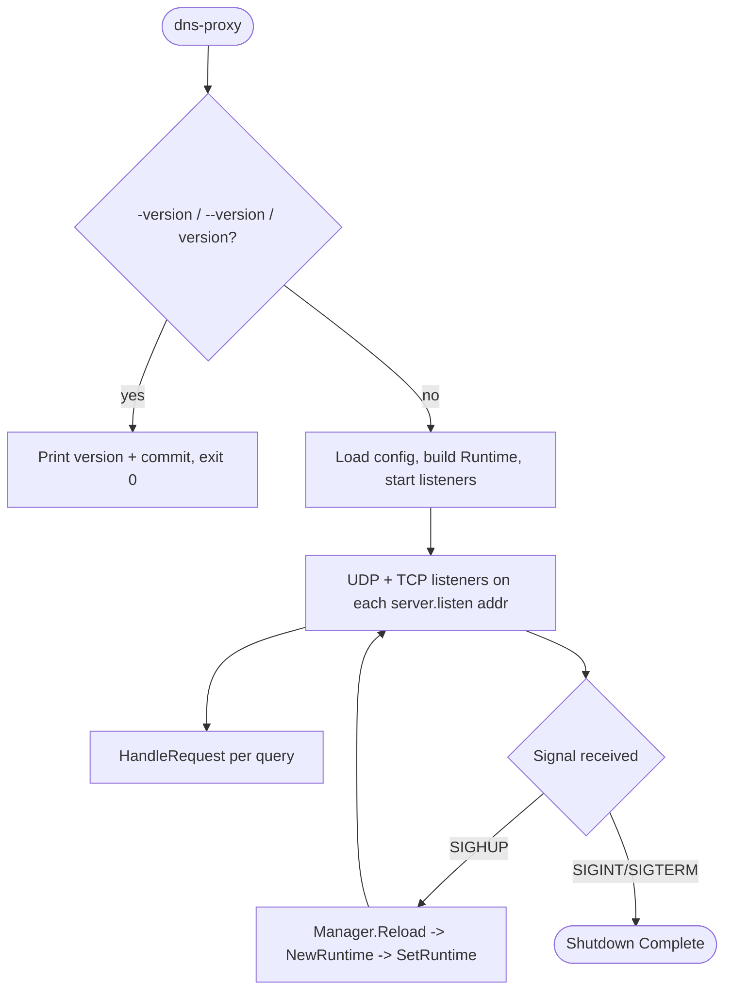
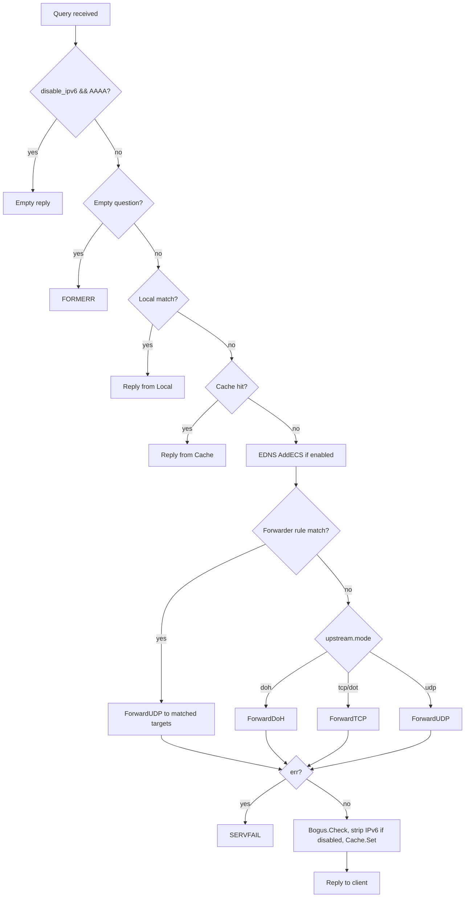

# DNS-Proxy — Workflows

Runtime request/data-flow traces through the DNS proxy — startup, per-query resolution, connection pooling, and hot-reload. **Config defaults:** see `dns-proxy.yaml.example` — never guess values.

---

## Pipeline Overview

## Startup (`cmd/dns-proxy/run.go`)

1. **Load config:** `config.NewManager(configFile)` — parses YAML, applies defaults, merges `include_files` globs. Fatal on error.
2. **Build server:** `server.New()` — empty `Server` with no `Runtime` installed yet.
3. **Initial reload:** `reload(srv, mgr)` — builds a `Runtime` via `server.NewRuntime(cfg)` and installs it with `srv.SetRuntime(rt)`. Fatal on error.
4. **Register handler:** `dns.HandleFunc(".", srv.HandleRequest)` — one handler for every query, any domain.
5. **Start listeners:** for each `server.listen` address, `server.StartListener("udp", ...)` and `server.StartListener("tcp", ...)` run as goroutines.
6. **Signal loop:** blocks on `SIGINT`/`SIGTERM`/`SIGHUP`. `SIGHUP` triggers reload and loops; anything else breaks out to `Shutdown Complete`.

## Query Flow

## Upstream Modes

| Mode | Transport | Forward method | Notes |
|---|---|---|---|
| `udp` | Plain UDP | `Client.ForwardUDP` | Pooled `*dns.Conn`, retries `max_attempts` times |
| `tcp` | Plain TCP | `Client.ForwardTCP` | Pooled connection, same retry logic as UDP |
| `dot` | TCP + TLS | `Client.ForwardTCP` | Same pool/dial path as `tcp`; TLS handled by the pool's `Dial` func |
| `doh` | HTTPS POST | `Client.ForwardDoH` | Not pooled — one `http.Client` per `Client`, tries each `DoHURLs` entry in turn |

### udp
`ForwardUDP` also serves forwarder-rule overrides (`overrides` param non-empty): each attempt dials one override address round-robin, bypassing the pool entirely.

### tcp / dot
Share `ForwardTCP` — the transport difference (plain vs TLS) lives entirely in the pool's injected `Dial` function, not in the forward logic.

### doh
`ForwardDoH` packs the query, POSTs `application/dns-message` to each configured URL, and returns the first `200` response. Requests go through `hybridRoundTripper`, which tries HTTP/3 (`quic-go/http3`) first and falls back to HTTP/2 on failure. Read buffers come from `Client.bufPool` (`sync.Pool`) to avoid a per-query allocation.

## Connection Pooling

`pool.Pool.Get()` returns a channel-buffered connection if one is available, otherwise dials via `NewConn()` (which tries each configured address in turn). `Return()` puts the connection back if the pool has room, else closes it. On a write or read failure, the caller closes the connection, calls `Return(nil)` to signal the pool, and retries — a reused connection that failed is treated differently from a freshly dialed one (`reused` bool) to avoid burning a retry attempt on a stale pooled connection.

## Hot-Reload

1. `SIGHUP` arrives on the signal channel in `runServer`'s loop.
2. `mgr.Reload()` — rebuilds config from disk via a fresh viper instance, re-merges `include_files`. On error, the previous config and `Runtime` stay active; the loop continues.
3. `reload(srv, mgr)` — `server.NewRuntime(cfg)` builds a complete new `Runtime` (fresh cache, pools, resolvers).
4. `srv.SetRuntime(rt)` — atomic pointer swap. In-flight queries using the old `Runtime` finish uninterrupted; the next `HandleRequest` call loads the new one.
5. Log lines report what was (re)initialized: connection pools, bogus-NXDOMAIN count, EDNS masks, cache size/shards, local/forwarder rule counts.

No filesystem watcher — reload is signal-driven only, unlike inotify/fsnotify-based designs.

---

## File Naming Conventions

| File | Location | Pattern |
|---|---|---|
| Config | root (or wherever `--config` points) | `<name>.yaml`, e.g. `dns-proxy.yaml` |
| Local include | `local.include_files` glob | `conf.d/local-*.yaml` |
| Forwarder include | `forwarder.include_files` glob | `conf.d/forwarder-*.yaml` |
| Config example | root | `dns-proxy.yaml.example` |

## Error Recovery

| Scenario | Recovery |
|---|---|
| Upstream timeout / dial failure | Retry up to `upstream.max_attempts`, then reply `SERVFAIL` |
| Malformed or empty question | Reply `FORMERR` immediately, no upstream call |
| Pool dial failure | `pool.NewConn` tries every configured address in turn before giving up |
| Reused pooled connection fails | Closed and discarded; retried without consuming a full attempt if it was a network-level read/write error |
| Config reload parse failure | Previous `Runtime` keeps serving; error logged, loop continues |
| `SIGINT` / `SIGTERM` | Signal loop breaks, logs `Shutdown Complete`, process exits |

---

## References

| File | Purpose |
|---|---|
| `cmd/dns-proxy/run.go` | Startup, signal loop, reload wiring |
| `internal/server/handler.go` | Per-query resolution pipeline |
| `internal/upstream/udp.go` | `ForwardUDP` |
| `internal/upstream/tcp.go` | `ForwardTCP` (tcp + dot) |
| `internal/upstream/doh.go` | `ForwardDoH` |
| `internal/upstream/roundtrip.go` | `hybridRoundTripper` (H3→H2 fallback) |
| `internal/pool/pool.go` | `Get`/`Return`/`NewConn` |
| `docs/ARCHITECTURE.md` | Module map, component roles, design decisions |
